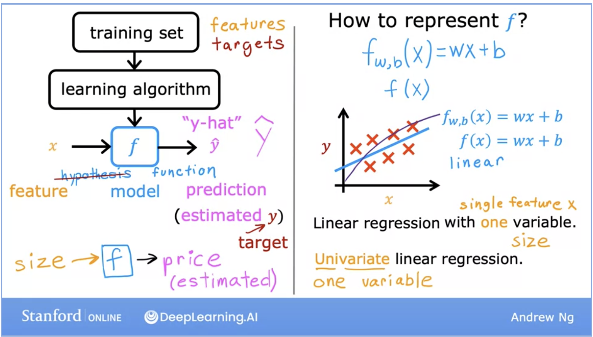

## SIMPLE LINEAR REGRESSION:

What is linear regressin?
- Linear Regression is a Supervised Machine Learning Model which pedicts a continuous value based on the given input features($X_1$, $X_2$, $X_3$, ....$X_n$)

- Linear Regression allows us to build a relationship between multiple features to estimate a target output.

- Linear Regression fits a line through the data sets.

- Say, we have details of a house like no of rooms, area, how many doors it has, etc. By taking these parameters as input features, we can predict the __COST ($y_0$)__ of the house.

Simple Linear Regression ?
- If the linear regression has only one independent and one dependent variable. Then it is called __SIMPLE__ or __UNIVARIATE__ Linear Regression.

- In this Regression model, the model genearates an equation of line. If it's an Univariate Regression, the equation will be __. $\hat{y}$ = $\beta_0 + \beta_1x$ .__

- This can alsio be written as; $h_\theta(x) = \theta_0 + \theta_1(x)$ 
    - Where, 
        - $\theta_0$ = intercept 
        - $\theta_1$ = slope of the line (fitted line) 

- Here, we call this line as Best Fit Line.
- To decide if whether the predicted line is Best fit or not, we find the __ERROR__ using differeent methods. Line at which the error is minimum, we call it __BEST FIT LINE__

- In above plot, we can see for different values of $\theta_1$ we are getting different lines. Among these we have to select the one with least errors.

- If we want to find the best fit line, we have to find(or change) the values of $\theta_0$ and $\theta_1$ till we reach to the point of __MINIMIUM ERROR__.

- Before moving ahead, lets see what is a slope? 
    - Slope is defined as ****change in y for one unit increase in X****

## How are we defining or finding the errors ?
 - Residual Error :
    - For some row j, residual error is $y^j$ - $\hat{y}^j$
        - Where $y^j$ -> Actual value; $\hat{y}^j$ -> Predicted Value

- Squared Error for row j :
    - $(y^j - \hat{y}^j)^2$

- Sum of Squared Error for __m__ rows
    - $\sum_{i=1}^{m} (y^j - \hat{y}^j)^2$

- Average Sqaured Error for __m__ rows
    - $\frac{1}{m} (\sum_{i=1}^{m} (y^j - \hat{y}^j)^2)$

## COST FUNCTION:
- Best fit line is found when Residual error is minimum.
- To find/ reduce the error, we use __COST FUNCTION__.
- Cost function tells how best a line fits.
- The squared error cost function is by far the most commonly used cost function for linear regression, and for all regression problems at large.
- A cost function is defined by some measure of error (Here we are taking __SQUARED ERROR__).
- Ultimately we have to minimize the cost function.

    - J($\theta_0,\theta_1$) = $\frac{1}{2m}(\sum_{i=1}^{m}(y^j - \hat{y}^j)^2$)
        - 
        

- We can minimixe the value of __COST FUNCTION__ by changing the values of intercept($\theta_0$) and SLope($\theta_1$).

- For simnpler calculation and 2D plot, let us take intercept($\theta_0 = 0$). It means our line is passing through the origin.
    - So, $h_\theta(x) = \theta_1 * x$

- Instead of changing values of te ocefficients manually, we use __GRADIENT DESCENT ALGOROTM__ to minimize the __COST FUNCTION__.

- When the cost ($J(\theta)$) is relatively samller(closer to zero), it means the model fits the data better than compared to other choixes of $\theta_0$.

- By assuming different values of $\theta_0$ and finding its respective Cost value. If we plot $\theta_0$ on X-axis and Cost($J(\theta_0)$) on Y-axis. We get an inverted bell curve.

- Point where value of Cost is minimum (here it is $J(\theta) = 0$ at $\theta_1 = 1$) is called __GLOBAL MINIMUM__.

- So, at $\theta_1 = 1$ our Cost function ($J(\theta)$) is minimum. At this value our line will be best fitted.

- Instead of assuming $\theta_0 = 0$ for simpler understanding, if we had assumed both values then the kind of plot we would have generated is 

## GRADIENT DESCENT:
- How to change the value of $\theta_0$ such that J($\theta_0$) is as minimum as possible ?

- To find the best values of $\theta_1$, we use __Gradient Descent__ also known as __CONVERGENCE ALGORITHM__.

- It is an __ITERATIVE__ process.

- This algorithm optimizes the Cost by changing the values of $\theta_1$ values.

- In simple words, we are automating the process of finding optimal coefficients.

- By taking small baby steps, Gradient Descent changes values of $\theta_0$ and $\theta_1$ such that they are moving towards the __minimial point__.

    1. $\theta_0$ = $\theta_0$ - $\alpha$ * $\frac{\partial}{\partial \theta_0}(J(\theta_0, \theta_1))$

    2. $\theta_1$ = $\theta_1$ - $\alpha$ * $\frac{\partial}{\partial \theta_1}(J(\theta_0, \theta_1))$

    - Here, $\alpha$ is called __LEARNING RATE__. Generally it is a small positive number. It controls how big each step should be while changing the coefficient values.

        

    - The partial derivative term ($\frac{\partial}{\partial \theta_1}(J(\theta_0, \theta_1))$) of the Cost function tells in which direction should we move in order to reach the __minimal point__.

        

    

    - If the value of derivative is negative(-ve) it means the slope is also negative. So , we add the differntial value to the existing point such that we move closer to the local minima point.
    
        Ex: $\theta_0$ = $\theta_0$ - $\alpha$ * (-z)

    - If the value of derivative is postive(+ve) it means the slope is also positive. So , we substract the differntial value to the existing point such that we move closer to the local minima point.
    
        Ex: $\theta_0$ = $\theta_0$ - $\alpha$ * (+z)

    

    - If learning rate($\alpha$) is very high, then that corresponds to a very aggressive gradient descent procedure where huge steps are taken down the hill.

    - We repeat above steps(i.e changing values of ($\theta_0$ and $\theta_1$) until we reach a __CONVERGENCE__. It is point a local minimum where parameters $\theta_0$ and $\theta_1$ no longer change much with each step.

    - NOTE : We have to simultaneously update both $\theta_0$ and $\theta_1$ .

## INTUITION:
repeat until convergence {

$\theta_0$ = $\theta_0$ - $\alpha$ * $\frac{\partial}{\partial \theta_0}(J(\theta_0, \theta_1))$

$\theta_1$ = $\theta_1$ - $\alpha$ * $\frac{\partial}{\partial \theta_1}(J(\theta_0, \theta_1))$

}

If we have Simple Cost function with only one Variable($\theta_1), then

J($\theta_1$) => $\theta_1 = \theta_1 - \alpha* \frac{\partial}{\partial \theta_1}(J( \theta_1)) $

## LEARNING RATE:

- Selecting the value of '$\alpha$' is very crucial for Gradient Descent to work properly.

- If learning rate is small, the gradient descent will work but it will be very slow.

- If it is too large, gardient descent may overshoot and never reach the nminimum. It will fail to Converge.

- Few good values of learning rate to start with are 0.001, 0.01, 0.1, 1 and so on.

- How to know if we have reached the mimimum point ?

    -  At minimum tangent value i.e Slope = 0

        so , $\frac{\partial}{\partial \theta_1}(J( \theta_1))  = 0$. $\theta_1$ is unchanged.

    - As we get nearer to the local minimum, gradient descent will automatically take smaller steps.

    - Hence Near Local Minima,
        - Derivative becomes smaller
        - Update steps become smaller

    

------------------

What is a linear regression ?
- Statistical method for predextive analysis ...

How we can calculate error in Linear regression ?
- MSE, RMSE, ...

Difference between Loss function and Cost Function ?
- loss is for one value, copst is for whole column.

Difference between MSE and MAE and RMSE
- ... 

How gradient descent works ?
- It is an iterative approach

Explain Indepth Mathematical Intitution and working of Linear Regression
- ...

Explain what the intercept term means ?

Assumptions of Linear regression ?

How hypothesis testing is used in Linear Regression ?

How would you decide the importance of Variable for the multivariate regression ?

R vs adjusted R^2

